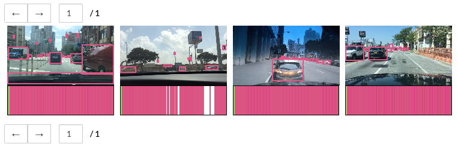

# rekall: spatiotemporal query language

[](https://travis-ci.com/scanner-research/rekall)
[](https://rekallpy.readthedocs.io/en/latest/?badge=latest)

Rekall is a spatiotemporal query language. It operates over sets of intervals
and allows for combining and filtering on temporal and spatial predicates.
In combination with the [VGrid](https://github.com/scanner-research/vgrid)
visualization widget, Rekall can be used to filter and visualize spatiotemporal
data:



Rekall has a main [Python API](https://github.com/scanner-research/rekall/tree/master/rekallpy)
for all the core interval processing operations. Rekall also has a
[Javascript API](https://github.com/scanner-research/rekall/tree/master/rekalljs)
which we use for the [vgrid](https://github.com/scanner-research/vgrid) video
metadata visualization widget.

## Getting Started
* Quickly [install](#installation) Rekall
* Try out the [tutorials](tutorials/)
* Check out the [documentation](https://rekallpy.readthedocs.io/en/latest/?badge=latest)
* View the [developer guide](#developer-guidelines)

## Sample Usage
Rekall provides utilities for processing spatiotemporal intervals (like bounding
boxes in a video).
This code sample shows how bounding boxes for a few videos can be loaded into
Rekall:
```python
from rekall import Interval, IntervalSet, IntervalSetMapping, Bounds3D
import urllib3, requests, os

# Load bounding box info from JSON files on server
urllib3.disable_warnings()
VIDEO_COLLECTION_BASEURL = "https://olimar.stanford.edu/hdd/rekall_tutorials/basics/"
metadata_files = [ 'driving1.json', 'driving2.json', 'driving3.json', 'driving4.json' ]
driving_metadata = [ requests.get(os.path.join(VIDEO_COLLECTION_BASEURL, metadata_file),
                                  verify=False).json()
                    for metadata_file in metadata_files ]

# Load bounding box data into Rekall
bbox_ism = IntervalSetMapping({
    video_file: IntervalSet([
        Interval(Bounds3D(t1=f['frame'], t2=(f['frame'] + 1),
                          x1=bbox['x1'], x2=bbox['x2'],
                          y1=bbox['y1'], y2=bbox['y2']),
                 payload = { 'class': bbox['class'], 'score': bbox['score'] })
        for f in metadata
        for bbox in f['bboxes']
    ])
    for video_file, metadata in zip([ 'driving1.mp4', 'driving2.mp4', 'driving3.mp4', 'driving4.mp4' ],
                                    driving_metadata)
})
```
Check out the [tutorials](tutorials/) for more on how Rekall can be used to
operate on this spatiotemporal data.

## Installation

### Python API
Rekall requires Python 3.5 or greater.
```
pip3 install rekallpy
```

### JavaScript API
The Rekall JavaScript API must be installed in the context of a JavaScript
application using the [npm package structure](https://docs.npmjs.com/about-packages-and-modules).
You must have [npm](https://www.npmjs.com/get-npm) installed.
```
npm install --save @wcrichto/vgrid
```

Now that you've installed Rekall, check out the [tutorials](tutorials/)!

## Developer Guidelines
If you are interested in contributing to Rekall (and we welcome contribution
via pull requests!), you should install Rekall from source:

[1] Clone the rekall repo
```
git clone https://github.com/scanner-research/rekall
```

[2] Install Python API from source
```
cd rekall/rekallpy
pip3 install -e .
```

And run tests:
```
python -m unittest discover test
```

[3] Install JavaScript API from source
```
cd rekall/rekalljs
npm install
npm run prepublishOnly
npm link
```
